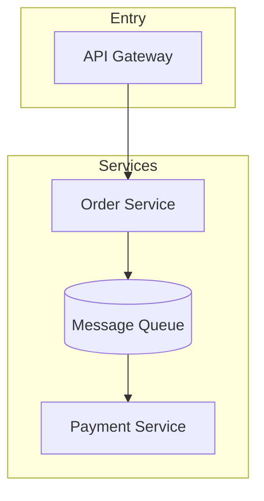
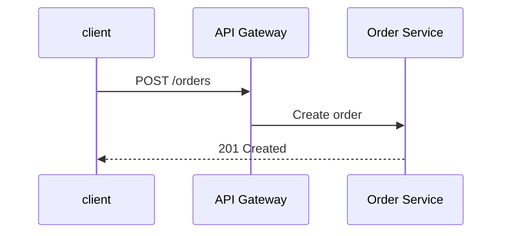

# Architecture Design: Order Platform (sample)

- **Date:** 2026-09-09
- **Author:** Sample
- **Status:** Draft

## 1. Background & Goals

- **Problem statement:** Order flows are implemented separately in every business line; a unified order platform is required.
- **Goals:** 1. Unify the order state machine; 2. support 10x the current order volume.
- **Non-goals:** Payment fund settlement stays out of scope.

## 2. Requirements (verified with stakeholders)

- **Functional:** Order → payment → fulfillment. Acceptance: order API P99 < 50 ms.
- **Constraints:** ~2k orders/s at peak; payment data kept out of PCI scope.
- **Assumptions:** Downstream services can consume events asynchronously.

## 3. Architecture Overview

### Key flow: Place order

## 4. Module List & Responsibilities

| Module | Responsibility | Public entry | Depends on |
|---|---|---|---|
| order-service | Order state machine | REST /orders | db, mq |
| payment-gw | Payment channel adapters | event pay.req | external channels |

## 5. Interface Definitions

### Module-level APIs

- `order.create(params) -> Order` — validates the input, creates the order, and throws a business exception on failure.

## 6. ADR Records

This section records key decisions.

### ADR-1: Event-driven instead of direct calls

- **Context:** Payment-result callbacks can overwhelm the order service at peak load.
- **Decision:** Introduce a message queue to decouple the callback path.
- **Consequences:** Compensation and reconciliation become necessary.

### ADR-2: Database selection

- **Decision:** PostgreSQL as the primary database.
- **Rationale:** Mature transactions and a healthy ecosystem.

## 7. 8-Dimension Self-Check

| Dimension | How the design addresses it | Status |
|---|---|---|
| 1. Functional Correctness | Requirements map to modules | ✅ |
| 2. Portability | Configuration is externalized | ✅ |
| 7. Performance / Scalability | 10x capacity estimate | ⚠️ Risk |

## 8. Evolution Roadmap

| Stage | Scope | Exit criteria |
|---|---|---|
| MVP | Ordering vertical slice | Order path P99 < 50 ms |
| Stage 2 | Payment decoupling | No lost orders at 5x peak |
| Stage 3 | Multi-tenancy | Isolation acceptance passed |
