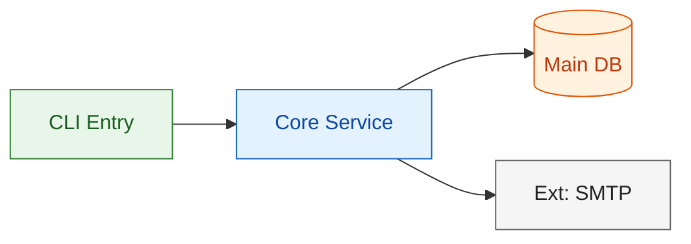
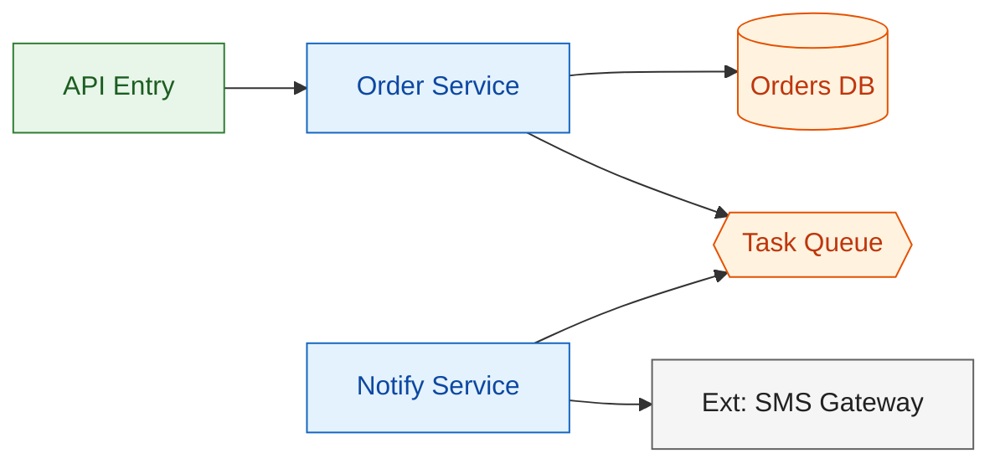

# Mermaid Architecture Diagram Spec

Mandatory rules for every architecture diagram produced by this skill. Aim: diagrams render everywhere (GitHub, VS Code, docs) and stay readable at a glance.

## 1. Diagram Type Selection

| Purpose | Mermaid type | When |
|---|---|---|
| System overview (components + dependencies) | `flowchart LR` with subgraphs as layers | Default for architecture overview |
| Module relationships / dependency detail | `flowchart TB` | When overview gets crowded |
| Request/event flow between modules | `sequenceDiagram` | Key runtime paths, interfaces |
| State machine of core entity/workflow | `stateDiagram-v2` | Workflow-heavy systems |
| Deployment layout | `flowchart LR` (node groups as envs) | Only when deployment topology matters |

Rules:
- Always declare `direction LR` or `direction TB` explicitly on flowcharts.
- Use Mermaid v10+ compatible syntax only (no experimental features). Every diagram must be valid standalone Mermaid — verify mentally line by line before outputting.

## 2. Node Naming

- Node IDs: lowercase snake_case or PascalCase **module names** (English), e.g. `order_service`, `order_service[Order Service]`.
- Node labels: `模块ID[中文名]` or `module_id[English Name]` — always a human-readable label, never a bare ID.
- External systems: mark with `Ext` prefix in the label, e.g. `ext_pay[Ext: Payment Gateway]`.
- Data stores: `db_orders[(Orders DB)]` (cylinder shape), queues: `queue_task{{Task Queue}}` (hexagon).
- No database-field-level detail in diagrams. A node is a module/system, not a table column.

## 3. Layer Colors

Use `classDef` consistently across all diagrams in one document:

Layer taxonomy:
- `entry` — entry points (CLI, API, scheduler, worker)
- `service` — business/module logic
- `data` — databases, caches, queues, files
- `external` — third-party / outside system

## 4. Size Limits

- **Max 15 nodes per diagram.** Over 15 → split into subgraphs on the overview, or produce a second focused diagram.
- One overview + key-path sequence diagrams (two-level output) is the norm for complex systems, not one giant diagram.
- Each diagram should answer exactly one question: "what are the components", "how does order creation flow", "how does the state change".

## 5. Consistency Rules

- Diagram MUST match the accompanying text (module list, interface definitions) exactly — same module names, same dependencies.
- After drawing, do a self-check pass: for every edge, verify it corresponds to a documented dependency; for every node, verify it appears in the module list.
- If text and diagram disagree, fix the diagram first, then re-check the text.

## 6. Valid Example

## 7. Render Check

Before outputting a diagram, mentally validate:
- [ ] `flowchart` has `direction` declared; `sequenceDiagram`/`stateDiagram-v2` has correct title
- [ ] All bracket types balanced (`[]`, `()`, `{{}}`)
- [ ] No node ID contains spaces or special characters except `_`
- [ ] classDef colors are on `fill:`, `stroke:`, `color:` keys only
- [ ] Node count ≤ 15; if not, split
