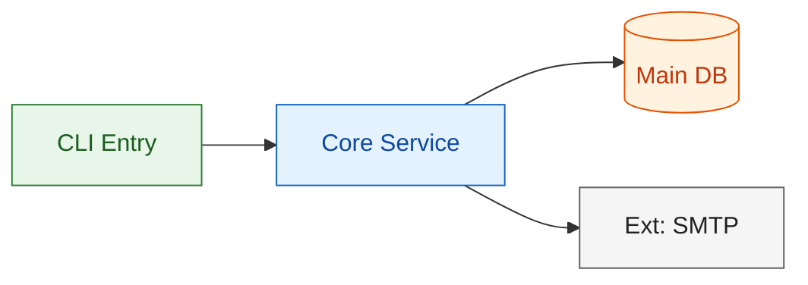
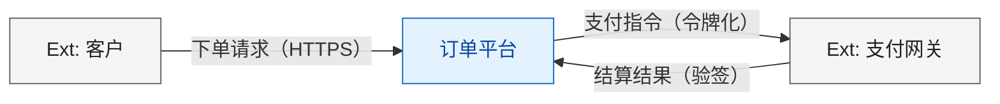
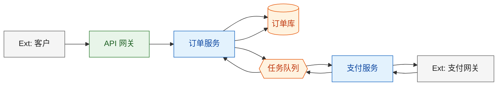
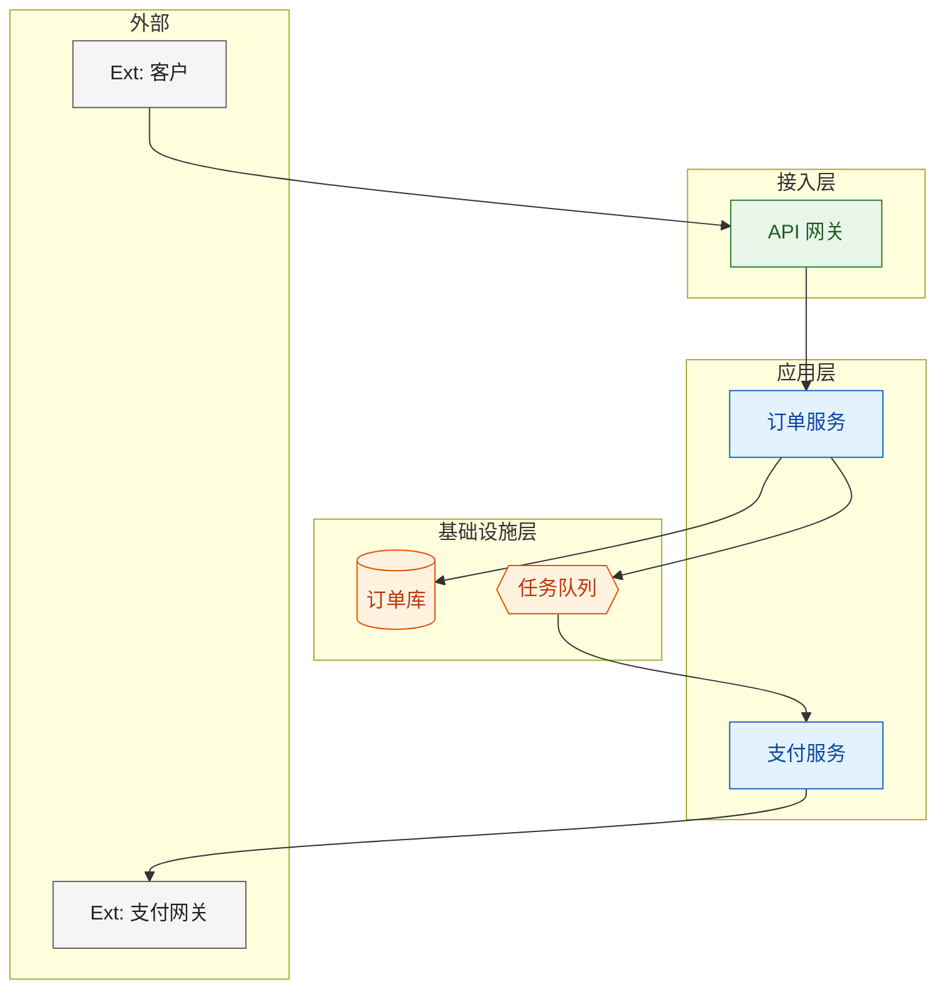
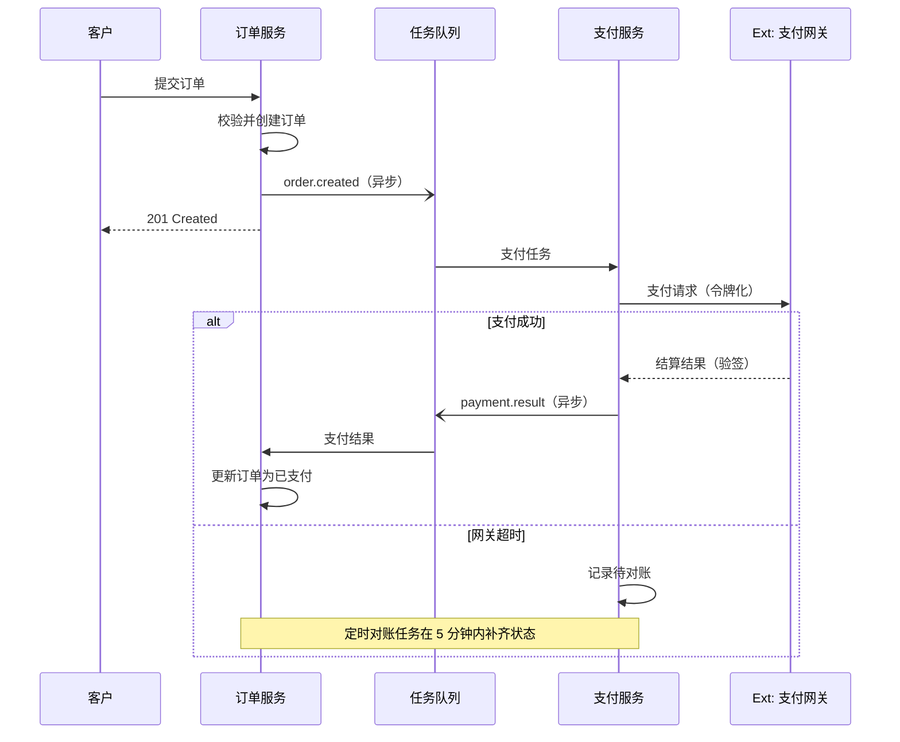
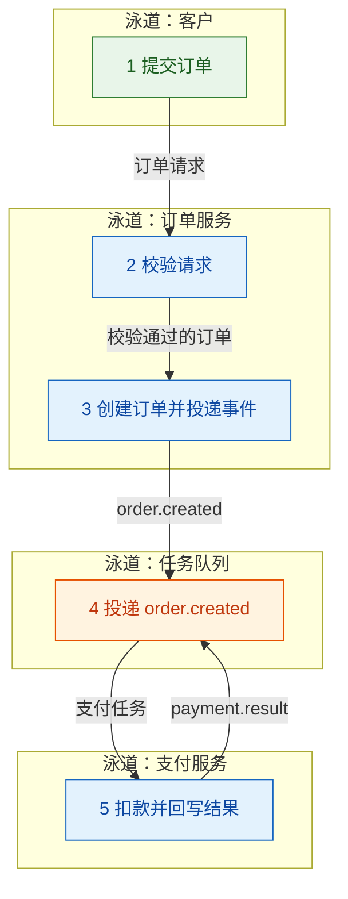
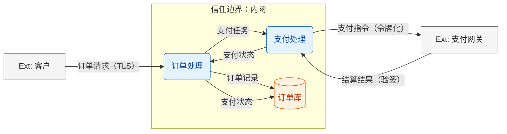

# Mermaid Architecture Diagram Spec

Mandatory rules for every architecture diagram produced by this skill. Aim: every diagram answers exactly one question, renders everywhere (GitHub, VS Code, docs), and agrees with the other diagrams and the text.

`check_views.py` (next to `html/md2html.py`) implements most of the rules below as a runnable check — run it on the draft before delivering.

## 1. View Catalogue (视图清单)

**Mandatory — all five, in every architecture document (design *and* review As-Is):**

| # | View | Answers | Mermaid type | Heading (design / review) |
|---|------|---------|--------------|---------------------------|
| 1 | **System context** 系统上下文 | Where is the system boundary; who/what outside talks to it and about what? | `flowchart LR`, one box for the system + `Ext:` nodes | `3.1 System Context` / `2.1 System Context` |
| 2 | **Component** 组件视图（架构图） | Which parts exist (modules/containers), which are data stores, and who depends on whom? | `flowchart LR` (+ subgraphs for grouping) | `3.2 Component View` / `2.2 Component View` |
| 3 | **Layered** 分层视图（分层图） | What lives in which layer, and is the dependency direction legal? | `flowchart TB`, one `subgraph` per layer + externals band | `3.3 Layered View` / `2.3 Layered View` |
| 4 | **Runtime** 运行时视图（时序图） | For one key flow: in what order do modules interact, what is sync vs async, and what happens on failure? | `sequenceDiagram` (one per key flow) | `3.4 Runtime View: {flow}` / `2.4 Runtime View: {flow}` |
| 5 | **Data flow** 数据流视图（数据流图） | Where does data come from, what transforms it, where is it stored, and which trust boundary does it cross? | `flowchart LR`, every edge labeled with data | `3.5 Data Flow View` / `2.5 Data Flow View` |

**Conditional — draw when the trigger holds (the trigger is a fact about the system, not a preference):**

| View | Draw when | Mermaid type | Heading |
|------|-----------|--------------|---------|
| **Deployment** 部署视图 | More than one node/environment/network zone (distributed or multi-env) | `flowchart LR`, node groups as environments | `3.6 Deployment View` / `2.6 Deployment View` |
| **State machine** 状态机视图 | A core entity has ≥4 states, concurrent states, or state-dependent rules | `stateDiagram-v2` | `3.7 State Machine` / `2.7 State Machine` |
| **Data model** 数据模型（ERD） | The data model is the main coupling point (shared database, many consumers) | `erDiagram` | `3.8 Data Model` / `2.8 Data Model` |

**Not in the catalogue — on request only:** a cross-functional **swimlane view** (泳道图) is produced **only when the user explicitly asks for it** (its rules are kept in §3.4). It is a business-process view, not an architecture view: for service-to-service flows the runtime view states the same thing more precisely, Mermaid has no native lane syntax (it is a `flowchart` with lane subgraphs, whose layout the renderer may reorder), and maintaining it in parallel with the runtime view is a known drift source. When it is asked for, draw it and keep it consistent like any other view.

**Rules that apply to the catalogue itself:**

- A mandatory view that genuinely cannot be drawn keeps its heading plus **one explicit line**: `不适用的原因：…` / `Not applicable because …`.
- The layered and component views may be merged into one "layered component diagram" for a genuinely small system **only with an explicit `因…合并 / merged because…` line**. Do not silently drop a view.
- A conditional view whose trigger holds and that still is not drawn needs the same one-line reason; a conditional view whose trigger does not hold is simply omitted (no note required).
- Extra diagrams are welcome (e.g. a second runtime view per flow). The catalogue is a floor, not a ceiling.
- Every diagram is followed by one line: `看图重点：…` / `Read this for: …`. A diagram without a stated question is decoration.

## 2. Mandatory View Rules

### 2.1 System Context

- Exactly one node represents the system itself (labeled with the system name, `classDef entry` or `classDef service`); every other node is external and labeled `Ext: …`.
- Every external system/actor that appears in ANY other view must appear here — this view is the **single source of truth for external actors**.
- Edges carry what crosses the boundary (`订单请求（HTTPS）` / `payment request (tokenized)`), not verbs like "uses".
- ≤8 external nodes; if more, group them (`Ext: 银行渠道组`).

### 2.2 Component View

- Nodes are modules/containers/data stores/external systems — never database columns or class names.
- The node set must equal the module list (section 4 of the design template) one-to-one; every edge must correspond to a documented dependency.
- Data stores use the cylinder `[(...)]` (queues may use the hexagon `{{...}}`); externals keep the `Ext:` prefix.
- **A store node must have at least one inbound and at least one outbound edge** — a store nobody reads (or nobody writes) is a defect to fix or to flag, not to draw.
- Group by concern with `subgraph` when it helps; do not fake layers here (that is view 3).

### 2.3 Layered View

- **The node set must be identical to the component view's node set** — layers only arrange the same nodes (externals go in an explicit `外部/External` band). Adding or dropping a node here is the most common inconsistency; `check_views.py` fails on it.
- Declare layers as `subgraph` blocks top-to-bottom in dependency order (接入层 / 应用层 / 领域层 / 基础设施层, or whatever the system really has). Name layers by *what they are allowed to know*, not by technology.
- Edges must follow the allowed direction (upper → lower). A real violation found while analysing the system is valuable evidence: draw it dashed (`-.->|越层调用 / layer skip|`) **and** list it in the accompanying layer table.
- Ship a small table: layer → responsibility → allowed dependencies. The diagram shows direction; the table states the rule.

### 2.4 Runtime View (sequence)

- One diagram = one key flow, named in the heading (`3.4 Runtime View: Place order`).
- Participants are modules from the component view (or external actors from the context view) — no invented participants.
- Mark asynchronous hops explicitly (`-)` / `-->>` with a label like `order.created (async)`), and show where the caller stops waiting.
- **Show at least one failure branch** (`alt` / `else` / `opt` + the compensation or retry), otherwise the diagram documents only the happy path.
- Include the terminal state change (what got written where) so the flow can be verified against the data flow view.

### 2.5 Data Flow View (DFD)

- Processes are rounded (`p_order(订单处理)`), stores are cylinders, externals are `Ext:` nodes; **every edge is labeled with the data it carries** — that label is what makes it a DFD.
- Mark trust boundaries with a `subgraph` (`subgraph tb_int["信任边界：内网"]`); annotate data crossing a boundary with its protection (`订单请求（TLS）`).
- Add a level-0 context diagram only when the system has ≥3 external entities or the boundary is the point of the review; otherwise level 1 is enough.
- Stores and externals used here must come from the component view (`check_views.py` fails otherwise). Processes may be synthesized from modules but must carry recognizable names.
- State ownership and retention **in the text**, not inside the diagram.

## 3. Conditional View Rules

### 3.1 Deployment View

- Node groups = environments/zones (`subgraph prod["生产环境"]`); nodes = runtime units (`svc_order[order-service ×3]`), stores, and network boundaries.
- Label cross-zone edges with the protocol/port; note the scaling unit (replicas, part of the label).
- Secrets/credentials are never drawn as nodes; refer to the secret store instead.

### 3.2 State Machine

- One diagram per core entity/workflow; states are business states, not implementation flags.
- Label transitions with the triggering event; mark terminal states; if the analysis found illegal or missing transitions, say so in the text next to the diagram.

### 3.3 Data Model (ERD)

- Only entities that more than one module touches, with the key fields that define the relationship; no full DDL.
- Mark ownership: which module owns (writes) each entity — this is what the ERD is for in a review.

### 3.4 On request: Swimlane (cross-functional) view

Not part of the catalogue (§1) — draw it only when the user asks for it. When drawn, it follows these rules, and `check_views.py` validates it like any other view:

- One diagram = one core flow. Lanes = participants that act (`泳道：订单服务` / `Lane: Order Service`); every lane participant must exist in the context or component view.
- Steps are numbered in the node label (`s3["3 创建订单"]`).
- Edges are hand-offs and must name the artifact being passed (`s2 -->|库存校验请求| s3`), never the verdict (`|校验通过|`) and never a bare verb. Show the return hops.
- ≤6 lanes and ≤15 step nodes in total; split by phase (`下单` / `履约`) when larger.
- Its honest use case is showing what the other views cannot: **manual steps, off-system workarounds and cross-team responsibility**. If the diagram only re-states the runtime view, it is not worth shipping — say so and drop it.

## 4. Language Rules (语言规则)

- **All diagram text follows the document language** chosen at the start of the run — one language per document, never mixed. Chinese document → `svc_order[订单服务]`; English document → `svc_order[Order Service]`.
- **Node IDs stay ASCII snake_case in English** in both cases (`order_service`, `s3`, `db_order`): IDs are identifiers, labels are prose.
- Keep the structural keywords as written here (`subgraph`, `direction`, `classDef`, `participant`) — they are syntax, not content.

## 5. Node Naming

- Node IDs: lowercase snake_case or PascalCase **module names** (English), e.g. `order_service`, `order_service[Order Service]`.
- Node labels: always a human-readable label, never a bare ID.
- External systems: `Ext:` prefix (`ext_pay[Ext: 支付网关]` / `ext_pay[Ext: Payment Gateway]`).
- Data stores: `db_orders[(Orders DB)]` (cylinder); queues: `queue_task{{Task Queue}}` (hexagon).
- No database-field-level detail in diagrams. A node is a module/system, not a table column.

## 6. Layer Colors (one palette for every view)

- `entry` — entry points (CLI, API, scheduler, worker, the system box of the context view)
- `service` — business/module logic **and DFD processes**
- `data` — databases, caches, queues, files **and DFD data stores**
- `external` — third-party / outside system, actors **and DFD external entities**

Layers are expressed by `subgraph`; the four colors stay the same in all views so a reader learns one palette per document.

## 7. Size Limits

- **Max 15 nodes per diagram, counted across all subgraphs.** Roughly: context ≤8 externals + 1 system box; component ≤15 nodes; layered = the component node set exactly; DFD ≤12 processes/stores + ≤3 externals; deployment ≤15 nodes; ERD ≤10 entities; a swimlane drawn on request ≤6 lanes and ≤15 step nodes in total (not per lane).
- Over the limit → split by concern (or by flow phase) into a focused second diagram; never shrink the font or drop labels to make one giant diagram fit.
- One diagram answers one question (§1). Five mandatory views + the triggered conditional ones + per-flow runtime diagrams is the norm for complex systems, never one giant diagram.

## 8. Consistency Rules (hard)

1. **Single source of truth for externals:** every `Ext:` node in any view must appear in the system context view.
2. **Node-set equality:** the layered view contains exactly the component view's nodes (plus nothing else).
3. **Stores:** every store in the DFD must exist in the component view; every store has an inbound and an outbound edge.
4. **Participants:** every runtime-view participant exists in the context or component view (the same applies to swimlane lanes when one is drawn on request).
5. **Edges match dependencies:** for every edge, verify it corresponds to a documented dependency (module list/interface definitions); for every node, verify it appears in the module list.
6. **Data names:** DFD edges name the data crossing them (swimlane edges the hand-off artifact, when one is drawn).
7. **Conflict resolution:** if text and a diagram disagree, **fix the diagram first, then re-read the text** — and if the system really behaves as drawn, say so explicitly in the text (a review finding, not a silent contradiction).
8. After any diagram change, re-run `check_views.py` (and re-check the views above) before delivering.

## 9. Valid Examples

### 9.1 System context

### 9.2 Component view

### 9.3 Layered view (same nodes, arranged)

### 9.4 Runtime view (sequence, with a failure branch)

### 9.5 Optional: swimlane view (on request only, §3.4)

### 9.6 Data flow view (DFD, with a trust boundary)

### 9.7 Other supported types

| Purpose | Mermaid type | When |
|---|---|---|
| Deployment layout | `flowchart LR` (node groups as environments) | Multiple nodes/zones (§3.2) |
| State machine of a core entity | `stateDiagram-v2` | ≥4 states or state-dependent rules (§3.3) |
| Entity relationships | `erDiagram` | Data model is the main coupling point (§3.4) |

## 10. Render Check

Before outputting a diagram, validate:
- [ ] All five mandatory views are present (or their one-line "not applicable / merged because" note is written); every triggered conditional view is present
- [ ] `flowchart` declares a direction; `subgraph` blocks are balanced (every `subgraph` has `end`)
- [ ] The layered view's node set equals the component view's; every `Ext:` node appears in the context view
- [ ] Every store has an inbound and an outbound edge; DFD and swimlane edges carry data/artifact names
- [ ] The runtime view shows at least one failure branch
- [ ] All bracket types balanced (`[]`, `()`, `{{}}`, `[()]`, `([])`); node IDs have no spaces
- [ ] classDef uses only `fill:`, `stroke:`, `color:` and is identical across the document
- [ ] Node count ≤ 15 per diagram (see §7); if not, split
- [ ] Every label is in the document language; every ID is ASCII
- [ ] `python check_views.py <draft.md>` passes (it automates the structural rules above)
