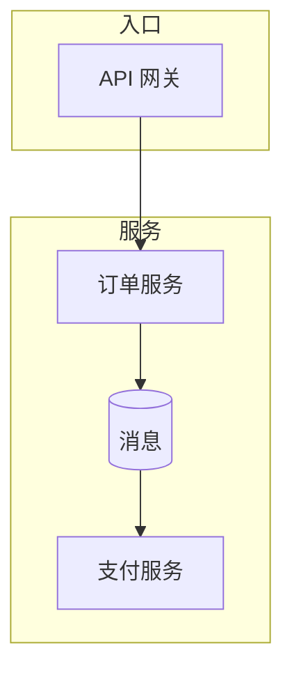
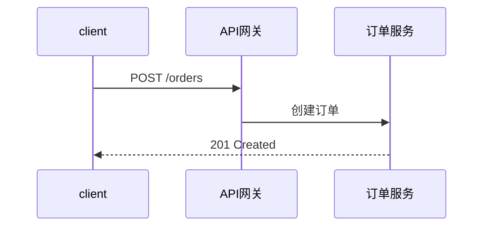

# 架构设计:订单中台(样例)

- **日期：** 2026-09-09
- **作者：** 样例
- **状态：** 草稿

## 1. 背景与目标

- **问题陈述：** 多个业务线下单流程重复开发,需要统一订单中台。
- **目标：** 1. 统一订单状态机;2. 支持 10 倍单量。
- **非目标：** 不做支付资金清算。

## 2. 需求(已确认)

- **核心流程：** 下单 → 支付 → 履约;验收:下单接口 P99 < 50ms。

## 3. 架构概览

### 关键流程:下单

## 4. 模块清单与职责

| 模块 | 职责 | 公共入口 | 依赖 |
|---|---|---|---|
| order-service | 订单状态机 | REST /orders | db, mq |
| payment-gw | 支付渠道适配 | 事件 pay.req | 外部渠道 |

## 5. 接口定义

### 模块级 API

- `order.create(params) -> Order` — 校验后创建订单,失败抛业务异常。

## 6. ADR 决策记录

本节约录关键取舍。

### ADR-1:事件驱动而非直连调用

- **背景：** 支付结果回调高峰期会打垮订单服务。
- **决策：** 引入消息队列解耦。
- **后果：** 需要补偿与对账。

### ADR-2:数据库选型

- **决策：** 主库 PostgreSQL。
- **理由：** 事务与生态成熟。

## 7. 8 维度自检表

| 维度 | 设计如何应对 | 状态 |
|---|---|---|
| 1. 功能正确性 | 需求→模块映射 | ✅ |
| 2. 可移植性 | 配置外部化 | ✅ |
| 7. 性能 / 可伸缩性 | 10 倍容量估算 | ⚠️ 风险 |

## 8. 演进路线图

| 阶段 | 范围 | 退出标准 |
|---|---|---|
| MVP | 下单纵向切片 | 下单链路 P99<50ms |
| 阶段 2 | 支付解耦 | 峰值 5 倍不丢单 |
| 阶段 3 | 多租户 | 隔离验收通过 |
