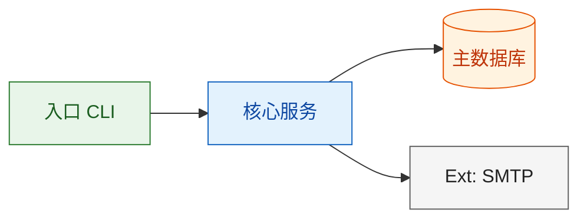
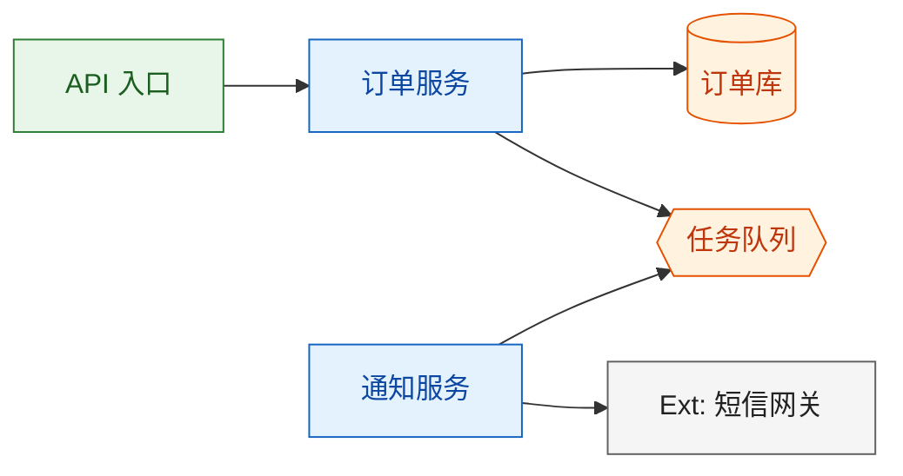

# Mermaid 架构图规范

本技能产出的所有架构图必须遵守的强制性规则。目标：图在任意环境（GitHub、VS Code、文档）都能正常渲染，且一眼可读。

## 1. 图型选型

| 用途 | Mermaid 类型 | 何时使用 |
|---|---|---|
| 系统概览（组件 + 依赖） | `flowchart LR` + subgraph 分层 | 架构概览的默认选择 |
| 模块关系 / 依赖细节 | `flowchart TB` | 概览图变拥挤时 |
| 请求/事件在模块间的流转 | `sequenceDiagram` | 关键运行时路径、接口 |
| 核心实体/工作流的状态机 | `stateDiagram-v2` | 重流程系统 |
| 部署拓扑 | `flowchart LR`（节点按环境分组） | 仅当部署拓扑重要时 |

规则：
- flowchart 必须显式声明 `direction LR` 或 `direction TB`。
- 只使用 Mermaid v10+ 兼容语法（禁用实验特性）。每张图必须是合法的独立 Mermaid——输出前逐行在脑中验证。

## 2. 节点命名

- 节点 ID：小写 snake_case 或 PascalCase **模块名**（英文），如 `order_service`、`order_service[Order Service]`。
- 节点标签：`模块ID[中文名]` 或 `module_id[English Name]`——必须有人类可读的标签，禁止裸 ID。
- 外部系统：标签加 `Ext` 前缀，如 `ext_pay[Ext: 支付网关]`。
- 数据存储：`db_orders[(订单库)]`（圆柱形状）；队列：`queue_task{{任务队列}}`（六边形）。
- 图上不画数据库字段级细节。一个节点是一个模块/系统，不是表的一列。

## 3. 分层配色

同一文档内的所有图统一使用 `classDef`：

层次分类：
- `entry` — 入口（CLI、API、调度器、worker）
- `service` — 业务/模块逻辑
- `data` — 数据库、缓存、队列、文件
- `external` — 第三方/外部系统

## 4. 数量限制

- **每张图最多 15 个节点。** 超过 → 概览图内拆 subgraph，或另出聚焦图。
- 复杂系统的标准输出是"一张概览图 + 关键路径时序图"两级，而不是一张巨型图。
- 每张图只回答一个问题："有哪些组件"、"订单创建流程如何走"、"状态如何流转"。

## 5. 一致性规则

- 图必须与配套文字（模块清单、接口定义）严格一致——模块名相同、依赖相同。
- 画完后自检一遍：每条边都要对应文档中的依赖；每个节点都要出现在模块清单中。
- 文字与图冲突时，先改图，再复查文字。

## 6. 合法示例

## 7. 渲染自检

输出任何图之前，逐项验证：
- [ ] flowchart 声明了 `direction`；sequenceDiagram/stateDiagram-v2 有正确的 title
- [ ] 所有括号类型配平（`[]`、`()`、`{{}}`）
- [ ] 节点 ID 不含空格和特殊字符（下划线除外）
- [ ] classDef 只使用 `fill:`、`stroke:`、`color:` 三个键
- [ ] 节点数 ≤ 15；超出则拆分
